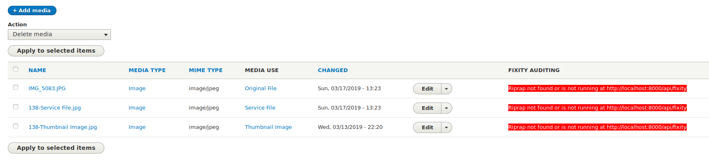
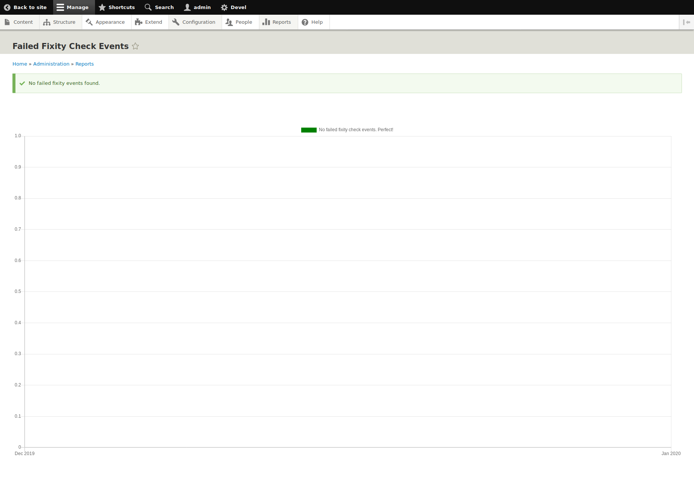
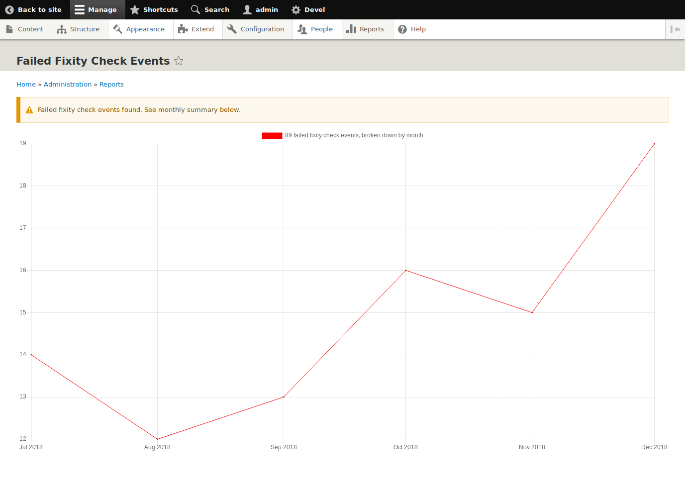

# Islandora Riprap

## Introduction

A Drupal 8/9 module to provide node-level and repository-level reports using data from a [Riprap](https://github.com/mjordan/riprap) fixity microservice.

## Overview

This module provides the following:

* A "Fixity auditing" field on the "Media" tab (which is actually the output of the "Manage Media" view provided by the Islandora module) showing Fedora URLs for Media associated with the node. Each URL is color coded to indicate whether or not any fixit events have failed, with a link to a full report of the events.
* A "Failed Fixity Check Events" report that show the numbers of failed events by month.
* While running in "local" mode, the ability to execute Riprap from within Drupal's cron.
* In conjunction with the [Islandora PREMIS](https://github.com/mjordan/islandora_premis) module, expresses file objects and fixity check events in Turtle RDF serialization.

## Requirements

* [Islandora 8](https://github.com/Islandora/islandora)
* A [Riprap](https://github.com/mjordan/riprap) fixity microservice.

This module is ready for Drupal 9.

## Installation

1. Clone this repo into your Islandora's `drupal/web/modules/contrib` directory.
1. Enable the module either under the "Admin > Extend" menu or by running `drush en -y islandora_riprap`.
1. Modify the "Riprap resource (media) list" View this module installs to determine which Media Riprap audits.

If you use the `PluginFetchResourceListFromDrupal` Riprap plugin, you will also need to enable Drupal's JSON:API module.

## Configuration

> Note: If you are running Islandora in a CLAW Playbook Vagrant machine and Riprap on the Vagrant host machine, start the Riprap web server by running `php bin/console server:start *:8001` in the Riprap directory. Then in Drupal, make sure your "Riprap microservice REST endpoint" setting says "http://10.0.2.2:8001/api/fixity".

Configuration options for Islandora Riprap are available at `admin/config/islandora_riprap/settings`, or at Configuration > Islandora > Fixity auditing.

### Remote vs. local mode

This module supports two ways of integrating with Riprap, either in "remote" mode or "local" mode.

* In remote mode, Drupal interacts with Riprap over HTTP. This mode allows Riprap to be running on a server separate from the one Drupal is running on. This is the recommended configuration for large site, or for sites that are using Riprap to perform fixity auditing on resources that are not all managed by Islandora.
* In local mode, Drupal executes Riprap's command-line interface. This means that Riprap needs to be running on the same server as Drupal. This configuration is simpler than the "remote" configuration, but will likely cause performance issues in large Islandora repositories. Local mode also allows you to use Drupal's cron to peridocally perform fixity checks.

### Enabling the Fixity Auditing summaries in each object's Media tab

1. Go to Drupal's "Configuration" menu.
   1. In the "Islandora" section, click on the "Fixity auditing" link.
   1. Adjust your config options.
1. Add the "Fixity Auditing" field to the "Manage Media" View (like you would add any other field to a view):
   1. In your list of Views ("Admin > Structure > Views"), click on the "Edit" button for the "Manage Media" View.
   1. In the "Page" display, click on the "Add" Fields button.
   1. From the list of fields, check "Fixity Auditing".
   1. Click on "Apply (this display)".
   1. Change the label if you want.
   1. Click on "Apply (this display)".
   1. Optionally, you can locate the new "Fixity Auditing" field to any position you want in the Media table.
   1. Click on the "Save" button to save the change to the View.

Now, when you click on the "Media" tab in an Islandora object node, you will see a new column in the table showing the Fedora URL for the media file:

The cell is green to indicate that all fixity events for the media file were successful. The "Details" link leads to a full report of the events.

If Riprap is not found or is not running at its configured endpoint URL, each cell will contain an error message to that effect:

### The Failed Fixity Check Events report

There is no separate configuration for this report. It can be accessed either from with the "Fixity Auditing" admin settings form at `admin/config/islandora_riprap/settings`, or from the "Islandora Riprap" row in Drupal's "Status report" list. If Riprap contains no failed fixity check events, you'll see the following:

If failed events exist, the report will inidcate the number of events per month:

### The Riprap resource list View

This module installs the "Riprap resource list" View, which is used by Riprap to get the media to perform fixity checks on. It comes preconfigured as follows:

* Fields: "Changed" and "Media: ID". Do not remove these fields.
* Filter criteria: Published nodes of type Repository Item
* Relationships
  * field_media_of: Content
  * file from field_media_file
  * image from field_media_image
  * file from field_media_audio_file
  * file from field_media_document

You will want to adjust the filter criteria to include your own content types, and, if you create new media types, the field that contains the new media's file.

## Current maintainer

* [Mark Jordan](https://github.com/mjordan)

## License

[GPLv2](http://www.gnu.org/licenses/gpl-2.0.txt)
