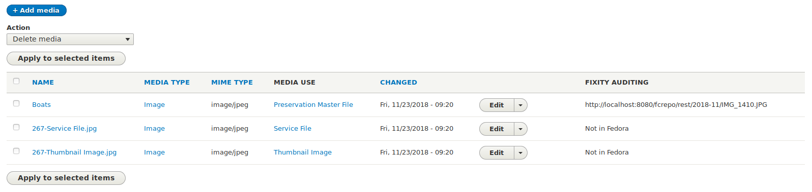

# Islandora Riprap

## Introduction

Beginnings of a Drupal 8 module to provide node-level reports using data from the [Riprap](https://github.com/mjordan/riprap) fixity microservice.

## Overview

Currently under development. So far, adds a "Fixity auditing" field to the "Media" tab (which is actually the output of the "Manage Media" view provided by the Islandora module) showing Fedora URLs for Media associated with the node. The goal is to replace the raw URLs with a report indicating how many successful and failed Riprap fixity events for each Media file.

## Requirements

* [Islandora](https://github.com/Islandora-CLAW/islandora) a.k.a. CLAW
* A [Riprap](https://github.com/mjordan/riprap) fixity microservice.

## Installation

1. Clone this repo into your Islandora's `drupal/web/modules/contrib` directory.
1. Enable the module either under the "Admin > Extend" menu or by running `drush en -y islandora_riprap`.
1. Add the "Fixity Auditing" field to the "Manage Media" View:
  1. In your list of Views, click on the "Edit" button for the "Manage Media" View.
  1. In the "Page" display, click on the "Add" Fields button.
  1. From the list of fields, check "Fixity Auditing."
  1. Click on "Apply (this display)".
  1. Change the label if you want.
  1. Click on "Apply (this display)".
  1. Click on the "Save" button to save the change to the View.

Now, when you click on the "Media" tab in an Islandora object node, you will see a new column in the table showing (for now) the Fedora URL for the media file:

## Configuration

1. Go to Drupal's "Configuration" menu.
1. In the "Islandora" section, click on the "Fixity auditing" link.
1. Adjust your config options.

## Current maintainer

* [Mark Jordan](https://github.com/mjordan)

## License

[GPLv2](http://www.gnu.org/licenses/gpl-2.0.txt)
