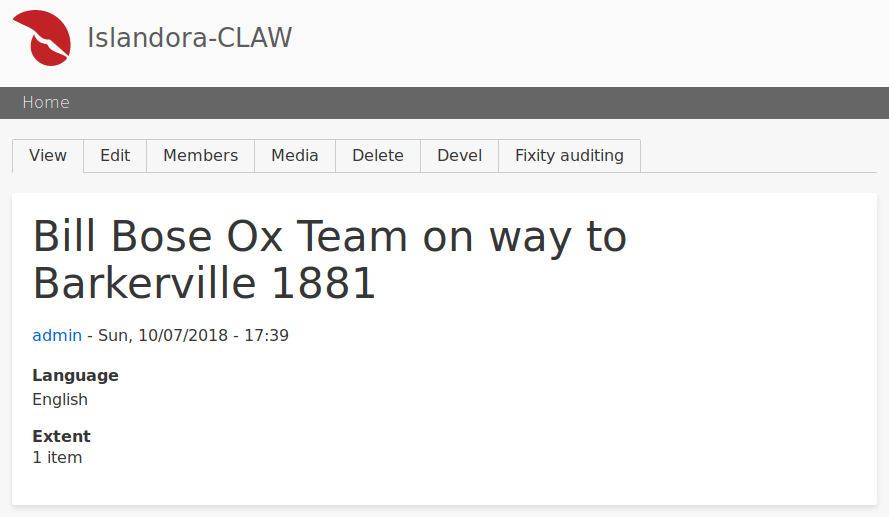

# Islandora Riprap

## Introduction

Beginnings of a Drupal 8 module to provide node-level reports using data from the [Riprap](https://github.com/mjordan/riprap) fixity microservice.

## Overview

Currently doesn't do anything useful other than add a "Fixity auditing" menu item to each node of `islandora_object` content type:

and display a very brief report indicating how many successful and failed events are in some sample data:

The report will eventually look better and more informative than this.

## Requirements

* [Islandora](https://github.com/Islandora-CLAW/islandora) a.k.a. CLAW
* A [Riprap](https://github.com/mjordan/riprap) fixity microservice.

## Installation

1. Clone this repo into your Islandora's `drupal/web/modules/contrib` directory.
1. Enable the module either under the "Admin > Extend" menu or by running `drush en -y islandora_riprap`.

## Installation

1. Go to Drupal's "Configuration" menu.
1. In the "Islandora" section, click on the "Fixity auditing" link.
1. Adjust your config options.

## Current maintainer

* [Mark Jordan](https://github.com/mjordan)

## License

[GPLv2](http://www.gnu.org/licenses/gpl-2.0.txt)
